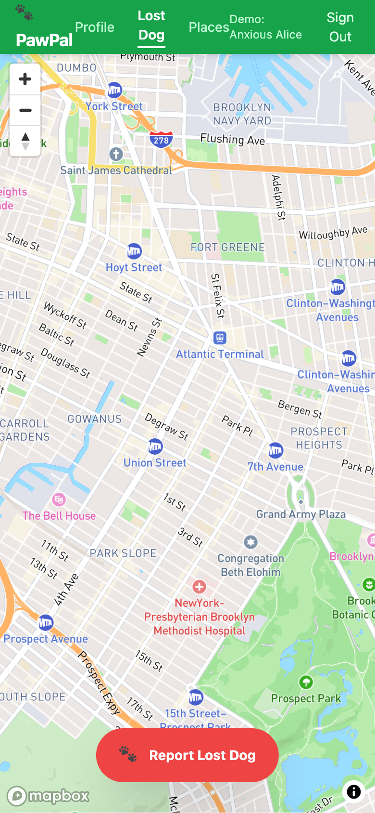

# PawPal

A mobile-first web app for reporting and tracking lost dogs. Owners drop a pin on a map, confirm their dog's details, and send an alert to nearby community members and local shelters.

---

## Why I built this

PawPal started as a General Assembly UX course project in 2014, one of my first as a young PM learning product design. The idea came from a real moment: I had lost my dog, and the experience of scrambling to notify neighbors and shelters made it clear there was no good tool for it. That pain point became my course final.

Years later, I rebuilt it in React to put the original concept into working code, and to show how a product idea moves from a UX exercise to a functional app.

---



---

## Demo

Click "Try Demo Mode" on the login screen to explore the app with a pre-loaded dog profile (Anxious Alice / Daisy the Beagle). No account required.

---

## Features

- **Map-based pin drop**: tap anywhere on the map to mark where the dog was last seen
- **Alert radius selector**: choose 1, 2, or 5 miles
- **Dog profile confirmation**: review breed, color, age, weight, and photo before sending
- **Confirmation panel**: shows notified user count, nearby shelters with contact info, and a "Mark as Found" resolution flow
- **Auth flow**: email/password sign-up and sign-in via Supabase Auth
- **Demo mode**: fully functional without a Supabase account

---

## Tech Stack

| Layer | Technology |
|---|---|
| Frontend | React 19, Vite 6, Tailwind CSS 3 |
| Map | Mapbox GL JS 3, Turf.js (radius circles) |
| Backend | Supabase (Auth, Postgres, Row Level Security) |
| Testing | Vitest, Testing Library |
| Deploy | Not yet deployed |

---

## Local Setup

### Prerequisites

- Node.js 18+
- A [Supabase](https://supabase.com) project (free tier works)
- A [Mapbox](https://mapbox.com) account with a public token

### 1. Clone and install

```bash
git clone https://github.com/eugenenam/pawpal.git
cd pawpal
npm install
```

### 2. Configure environment

Create `.env.local` in the project root:

```
VITE_SUPABASE_URL=https://your-project-id.supabase.co
VITE_SUPABASE_ANON_KEY=your-anon-key
VITE_MAPBOX_TOKEN=pk.your-mapbox-token
```

The Supabase anon key is safe to include here. It is embedded in the browser bundle by design; Supabase Row Level Security (RLS) enforces data access at the database level, not the key level.

For the Mapbox token, restrict it to your domain in the Mapbox dashboard (Account > Tokens > URL restrictions) to prevent quota abuse.

### 3. Run database migrations

In your Supabase dashboard, open the SQL editor and run each migration in order:

```
supabase/migrations/001_profiles.sql
supabase/migrations/002_dogs.sql
supabase/migrations/003_lost_dog_alerts.sql
```

### 4. Start the dev server

```bash
npm run dev
```

Open `http://localhost:5173`.

---

## Project Structure

```
src/
  components/
    layout/       # TopNav
    lost-dog/     # Multi-step lost dog flow (DropPinPanel, VerifyInfoPanel, ReviewPanel, ConfirmationPanel)
    map/          # MapView (Mapbox GL JS wrapper)
    panel/        # SlidingPanel, StepIndicator
  context/        # AuthContext (auth state, demo mode)
  lib/            # Supabase client
  pages/          # LoginPage, SignUpFlow, MainApp
  services/       # alerts.js (create/resolve alert)
supabase/
  migrations/     # SQL schema files (run manually via Supabase SQL editor)
  seed.sql        # Optional: reference data for a real demo account
```

---

## Running Tests

```bash
npm test          # watch mode
npm run test:run  # single run (CI)
```

---

## Known Limitations

- Shelter notifications are simulated; no real email/SMS delivery is implemented
- Notified user counts are placeholders until a real geo-query backend is wired up
- No push notifications or real-time updates
- Photo upload stores a blob URL in local state only; persistence to Supabase Storage is not yet implemented
